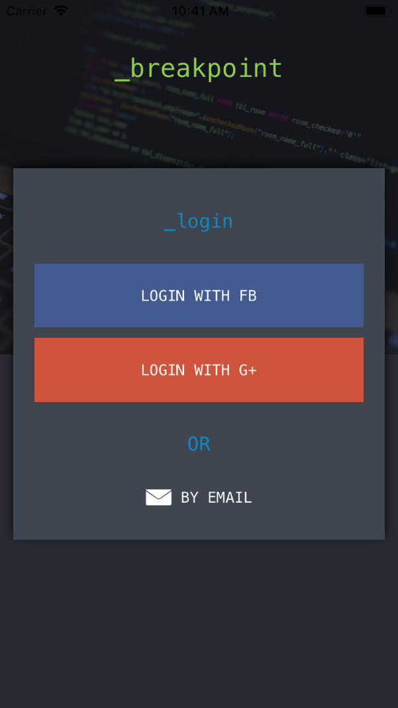
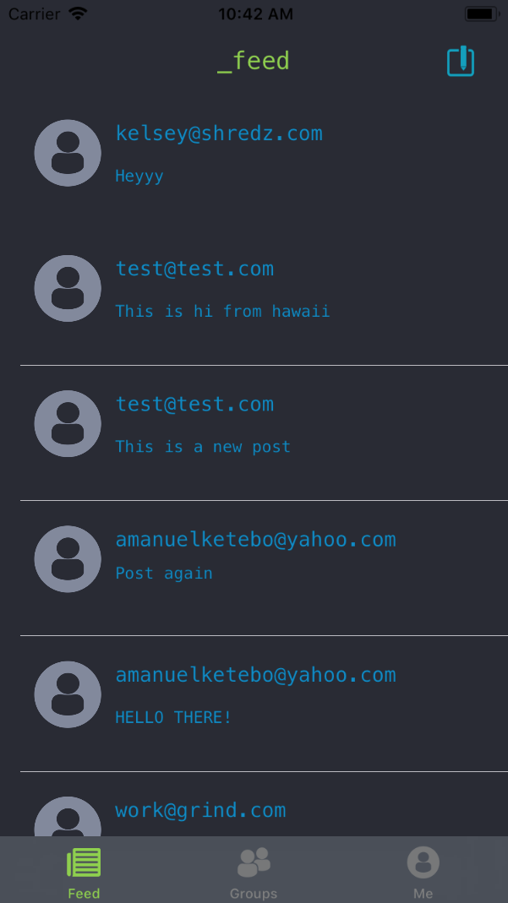
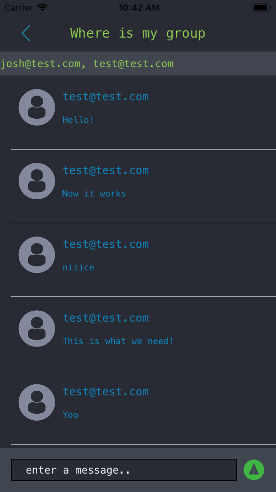
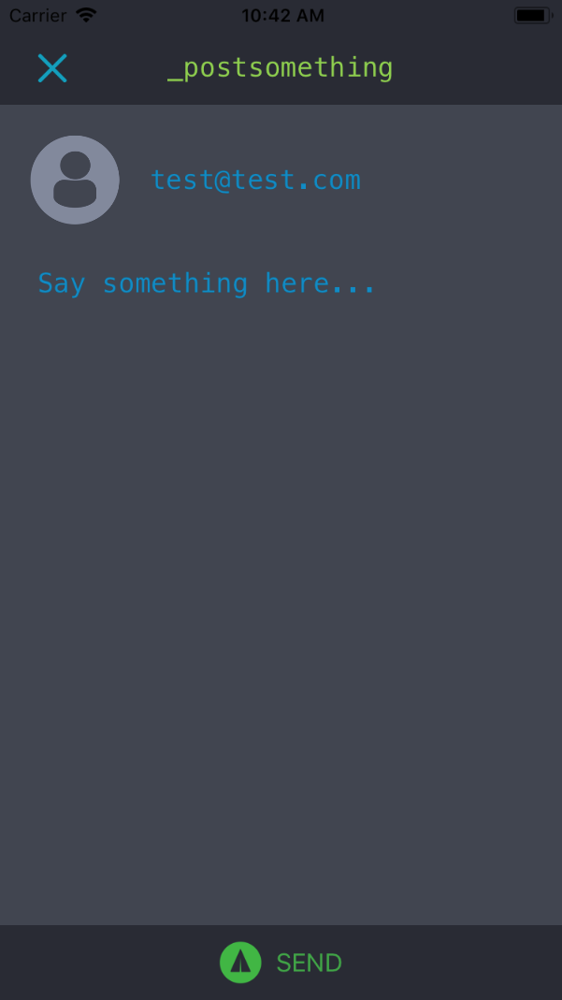
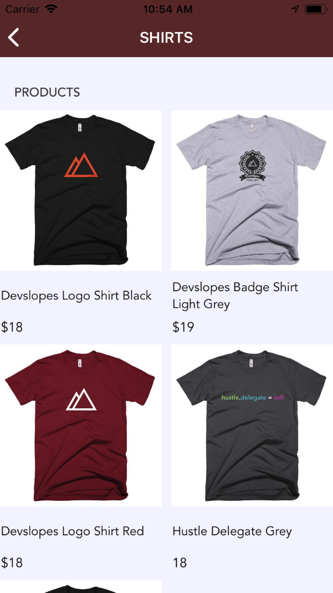
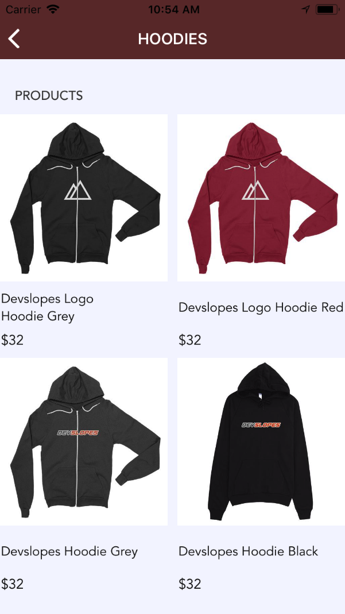
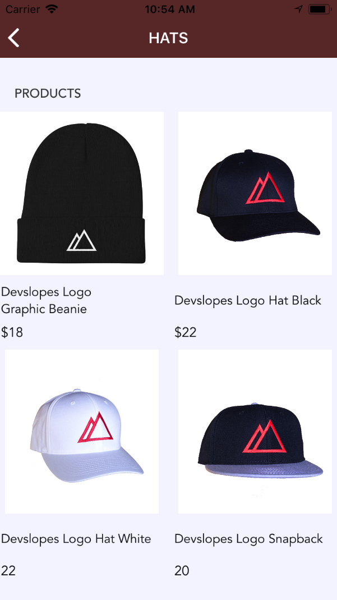
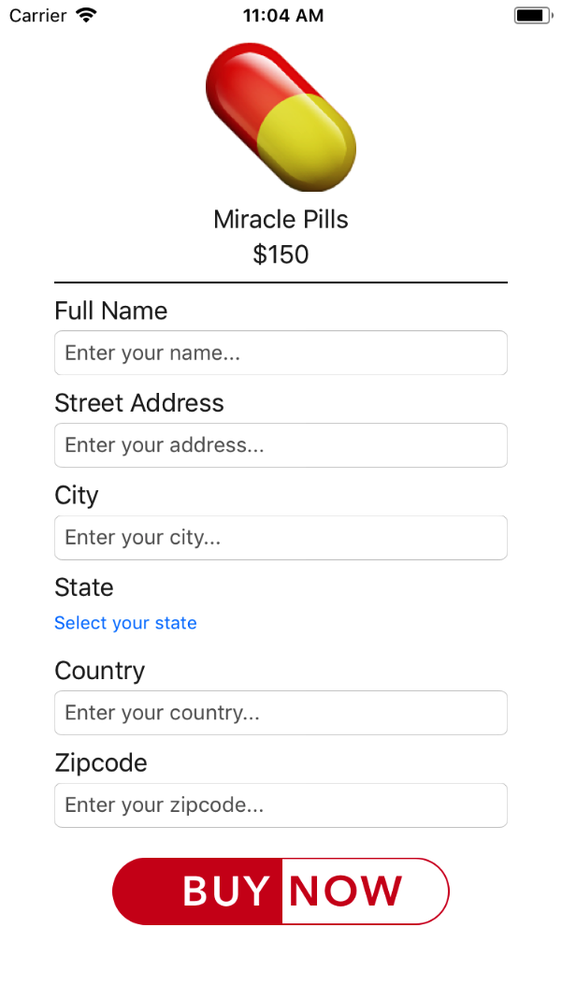
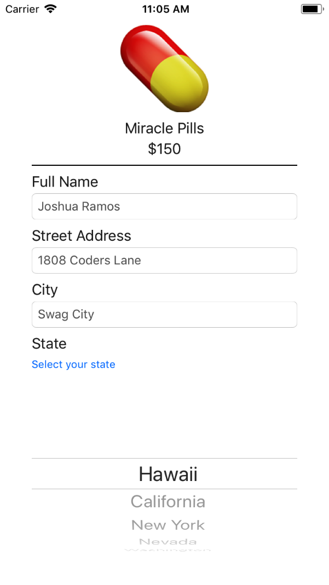
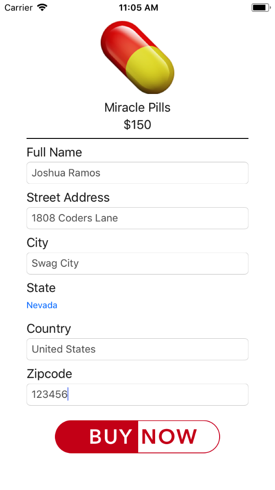

<!DOCTYPE html>
<html>
   <head>
   </head>
   <body>
      
      
      This is a collection of all the projects I have completed using Mark Price's <strong><em>iOS 11 & Swift 4: From Beginner to Paid Professional™</em></strong> course on Udemy. 

      

         
      

      <h1>Projects:</h1>
         <h2>BreakPoint:</h1>
         

         
         
         
         
         

         <h2>CoderSwag</h2>
         

         
         
         
         
         

         <h2>MegaPill</h2>
         

         
         
         
         

         <h2>PixelCity</h2>
         

         Pictures coming soon:
         

         <h2>Swoosh</h2>
         

         Pictures coming soon:
         

         <h2>WindowShopper</h2>
         

         Pictures coming soon:
         

   </body>
</html>
